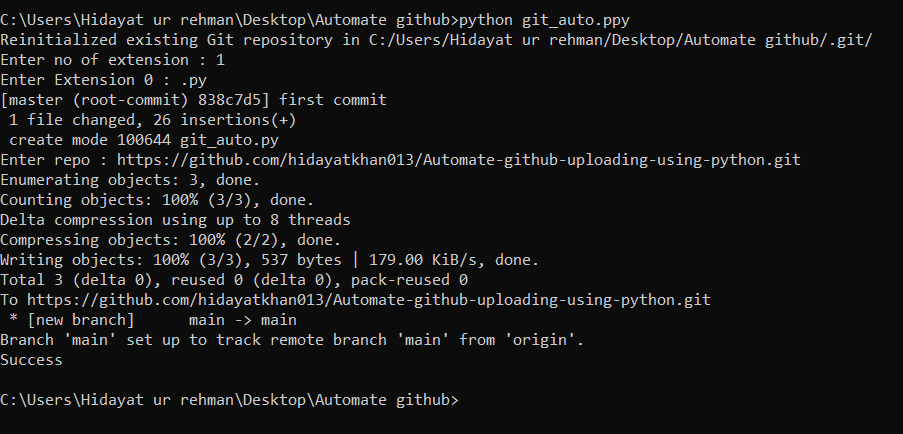

# Automate-github-uploading-using-python
# How to use this tool

1) Copy the git_auto.py to the directory which you want to upload to github 
2) Rename the extension of git_auto.py to git_auto.ppy (this will help in not uploading our git_auto.py file to github)
NOTE: You can also Make .exe of git_auto.py file
3) Run the git_auto.ppy using cmd in the same directory like (python git_auto.ppy) this cmd will run our python file
4) the program will ask for How many extension do you have in directory Like I Have 2 extension of c++ program i-e .cpp and .h So i will enter 2
5) Then program will ask for extension so I will enter .c++ .h 
6) then create repsotory in your Github and copy link of that repository and program will ask for that so paste it 
7) Done
See the screen shoot if any problem please comment 

